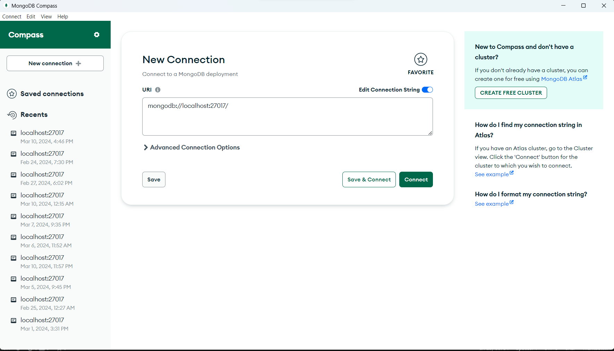
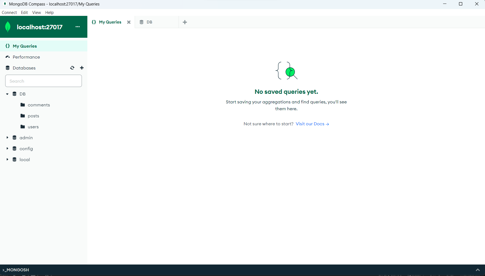

# FacebookServer

## Introduction

Welcome to Our Facebook server repo, this server is made for our React and Android Facebook apps that we developed during the course
Advanced Programming in BIU. this is a Node Js server so in order to run and use it you need some development environment that supports it. we recommend to you using VS-CODE for this server. in order to make this server work you will also need the software MongoDBCompass that you can install from the web. After this server is running you can use it in React/Android app by reading and cloning their repositories:

This Our React Facebook Repository: 

https://github.com/EliyaRabia/FacebookWeb/tree/Part3ConnectServer

(U can also use out react app without clone react repository, u can only run the server and then enter to the web using the port of the server http://localhost:8080/ u can also change the port to whatever do you want in config -> .env.local)

This Our Android Facebook App Repository: 

https://github.com/EliyaRabia/AndroidFacebook/tree/Part3ConnectServer 

## Here are 2 videos that show what our apps can do

React: https://www.youtube.com/watch?v=7xheojkxw5M 

Android: https://www.youtube.com/watch?v=onclwdYc8EU

## How to Run The Server? 

In order to run this server you first need to clone this repo into your computer with the command:

git clone https://github.com/orshmuel9/FacebookServer 

Now you will also need to set up MongoDBCompass to work with this server, 
Open MongoDBCompass and start by clicking connect when you have this url in the box: 

After that, add a database named "DB" and add for it 3 collections: "users", "posts", "comments". It should look like this: 

After you have done that, go into the cloned folder and run in terminal the command: 

npm install 

And after it finished, you can run the server with the command:

node app.js 

right now your server is running and you can use it for React and Android apps 
make sure you don't close the terminal of the running node js, because it will close the server...

## And thats it! please enjoy using our apps!
Written by:

Or Shmuel 

Eliya Rabia 

Ofek Yemini

